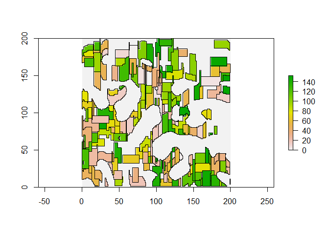

<!-- README.md is generated from README.Rmd. Please edit that file -->

# LGrafEU

<!-- badges: start -->
<!-- badges: end -->

LGrafEU is an artificial landcover generator that is designed to ease
the integration of artificial agricultural landcover maps in the work
flow of ecological modellers. The package is designed to generate
landscapes using different algorithms, and then store the information in
an output file that includes both a raster layer, and a list containing
all information of the fields. This package allows to generate
landscapes in a systematic reproducable way while controlling for
different variables.

## Installation

You can install the development version of LGrafEU from
[GitHub](https://github.com/) with:

``` r
# install.packages("devtools")
devtools::install_github("pogoyoly/LGrafEU")
```

## Example

This is a basic example which shows you how to solve a common problem:

``` r
library(LGrafEU)
## basic example code
r<-generate_perlin_noise(200,200,1,2,3,0.01,TRUE, "land_percentage", percetange = 75)
output<-establish_by_place_conquer(potential_space= r,
                         cell_size=1,
                         includsion_value = 1,
                         mean_field_size = 300,
                         sd_field_size = 100,
                         distribution = "norm",
                         mean_shape_index = 3,
                         sd_shape_index = 0.3,
                         percent = 70,
                         assign_farmers = TRUE,
                         assign_mode = 2,
                         mean_fields_per_farm = 3,
                         sd_fields_per_farm = 3)


plot_by_field(output)
```



What is special about using `README.Rmd` instead of just `README.md`?
You can include R chunks like so:

``` r
summary(cars)
#>      speed           dist       
#>  Min.   : 4.0   Min.   :  2.00  
#>  1st Qu.:12.0   1st Qu.: 26.00  
#>  Median :15.0   Median : 36.00  
#>  Mean   :15.4   Mean   : 42.98  
#>  3rd Qu.:19.0   3rd Qu.: 56.00  
#>  Max.   :25.0   Max.   :120.00
```

You’ll still need to render `README.Rmd` regularly, to keep `README.md`
up-to-date. `devtools::build_readme()` is handy for this.

You can also embed plots, for example:


In that case, don’t forget to commit and push the resulting figure
files, so they display on GitHub and CRAN.
